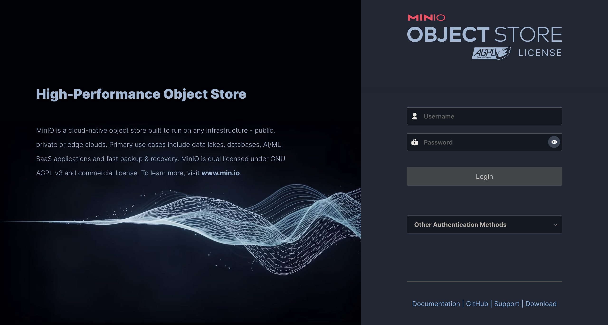
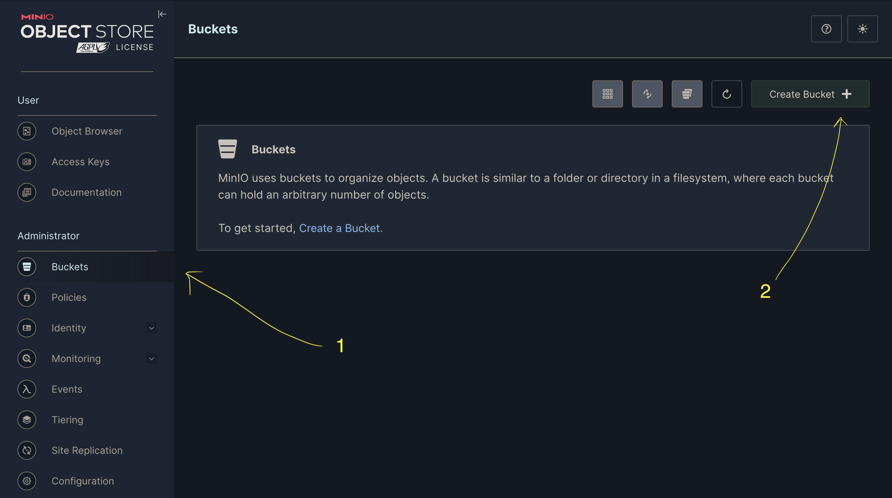
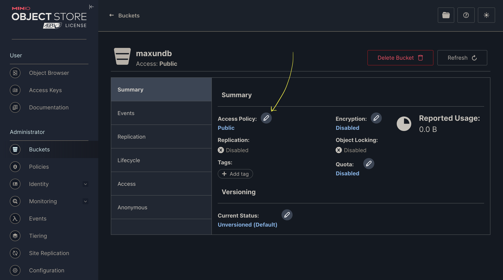
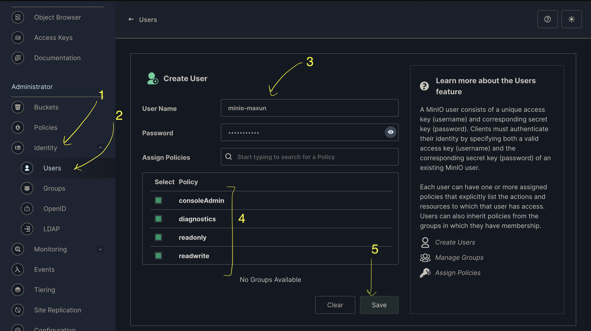
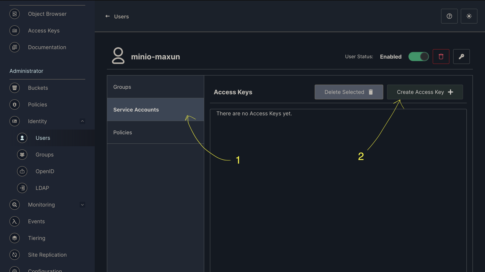
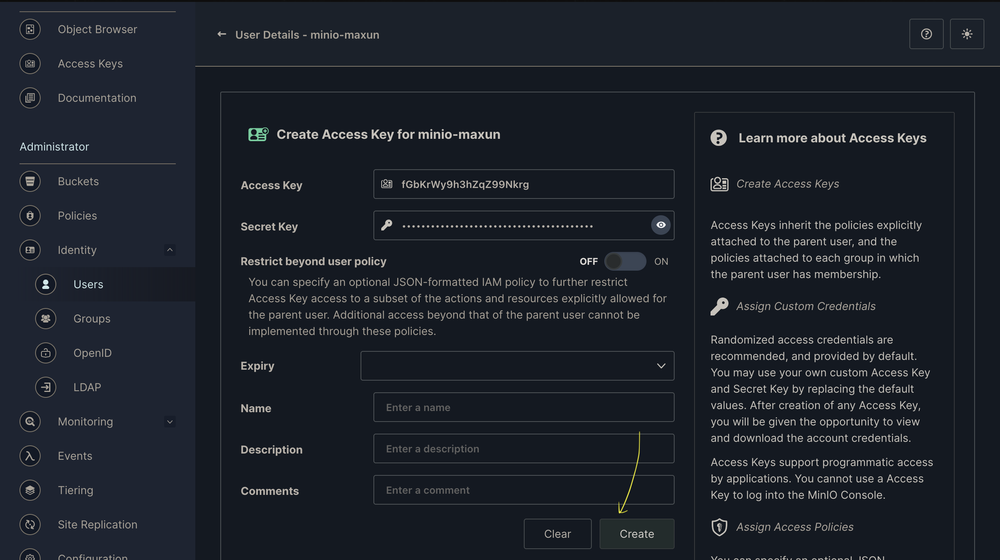
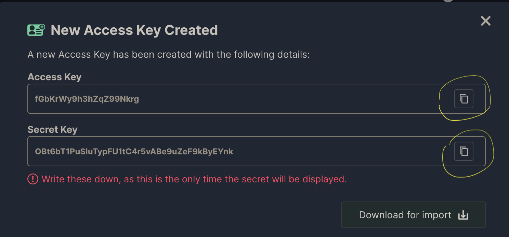

- [For MacOS](#for-macos)
  - [Redis installation](#redis-installation)
  - [Postgres Installation](#postgres-installation)
  - [MinIO installation](#minio-installation)


<a name="for-macos"></a>
# For MacOS

<a name="redis-installation"></a>
## Redis installation
```
# installing redis from Homebrew
brew install redis

# start instance of redis server in background
brew services start redis

# Check if its running using
brew services info redis

# for closing it use
brew services stop redis

# alternatively, start redis instance in foreground of terminal, note that the server will close if the terminal is closed
redis-server
```

Redis runs default on Port: 6379, which is already written in the sample .env file

<a name="postgres-installation"></a>
## Postgres Installation
```
# Installing postgres from Homebrew
brew install postgresql

# Check if postgres is installed properly using 
postgres -V
# >> postgres (PostgreSQL) 14.13 (Homebrew)

# Enter postgres CLI using
psql postgres

# After entering postgres CLI, which looks like "postgres=#  "
# Create a role name with password for accessing db
CREATE ROLE maxun WITH LOGIN PASSWORD 'maxun';

# Check if role is successfully created
\du

# Create a DB for maxun usage
CREATE DATABASE maxundb;

# Give all permissions related to the DB to the user
GRANT ALL PRIVILEGES ON DATABASE maxundb TO maxun;

# Check if the database is connecting by user "maxun"
# Quit postgres cli using
\q

# Re-enter as the user maxun
psql postgres -U maxun

# Try to connect with above created db
\connect maxundb
# You should see the message "You are now connected to database "maxundb" as user "maxun"."
```

<a name="minio-installation"></a>
## MinIO installation
```
# Install minio using homebrew
brew install minio

# Start a minio server 
minio server start

```

Minio Server information will then display on terminal like:
```
API: http://192.168.55.102:9000  http://127.0.0.1:9000
RootUser: minioadmin
RootPass: minioadmin

Console: http://192.168.55.102:49809 http://127.0.0.1:49809
RootUser: minioadmin
RootPass: minioadmin

Command-line: https://docs.min.io/docs/minio-client-quickstart-guide
   $ mc alias set myminio http://192.168.55.102:9000 minioadmin 
minioadminDocumentation: https://docs.min.io
```

- Copy the Console URL (the 2nd one), here i.e `http://127.0.0.1:49809` and open in a browser
- You will be welcomed with a login page, copy the RootUser and RootPass as mentioned above, here i.e `minioadmin`

- After entering dashboard, select "buckets" on left navbar, select "create bucket", and create a bucket named "maxundb"
- After the creation of bucket, make sure to visit the bucket page and change the access policy to "Public"



- Once the bucket is created, Go to "identities" section from navbar and under "user" subsection click "create user" and create a user with name and password "minio-maxun" with below settings

- After the user is created, go to the newly created user page, go into Service account section and click "Create Access key"

- Click the Create button and a popup will appear from where you can copy the Access and Secret key to paste it the .env file 



Also Check out the [Sample ENV](env_sample_without_docker.txt) for setting up Maxun without Docker
(Note that above variables names used in the example already)